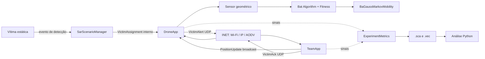
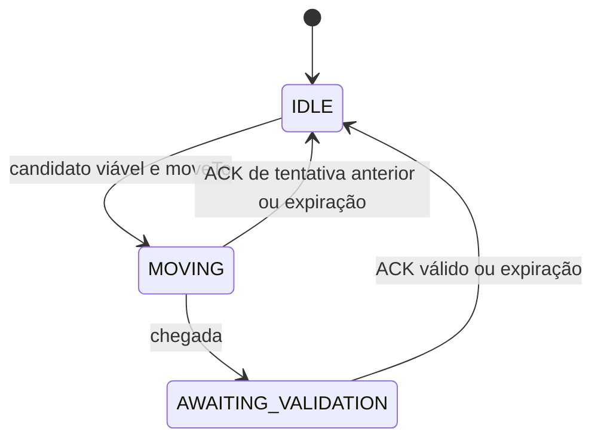

# Modelo, funcionamento e premissas

## 1. Finalidade e fronteira do sistema

O ECHOSAR-Net modela uma rede ad hoc de busca e salvamento na qual UAVs recebem
eventos de detecção de vítimas e tentam entregar alertas a equipes móveis. O
mecanismo experimental é o reposicionamento físico do UAV pelo Bat Algorithm
(BA) quando há evidência de degradação do enlace e, no modelo principal,
confirmação geométrica de obstáculo.

A pergunta do projeto não é se o BA encontra o ótimo matemático global. É se a
política implementada de detectar degradação, confirmar obstrução, escolher uma
posição viável e mover o UAV melhora a entrega fim a fim dos alertas sob o
modelo definido.

O modelo separa quatro planos:

- cenário: cria a detecção e escolhe o UAV responsável;
- aplicação: descobre equipes, transmite alertas, processa ACKs e decide quando
  consultar o mecanismo de reposicionamento;
- otimização e mobilidade: escolhem e executam fisicamente a posição candidata;
- observação: coleta eventos globais sem alterar o protocolo.

## 2. Componentes e responsabilidades

| Componente | Responsabilidade | Não faz |
| --- | --- | --- |
| `SarScenarioManager` | Agenda detecções, valida IDs e associa a vítima ao UAV selecionado | Não transmite a detecção pelo rádio |
| `DroneApp` | Mantém alertas pendentes, equipes descobertas, tentativas, ACKs e gatilho de reposicionamento | Não consolida sozinho a métrica global |
| `TeamApp` | Anuncia posição, recebe e deduplica alertas e responde com ACK | Não conhece o estado interno do BA |
| `AbstractObstacleSensor` | Consulta interseções geométricas na linha UAV–equipe | Não simula orientação, ruído ou classificação visual |
| `BatAlgorithm` | Busca uma posição de menor custo dentro da região permitida | Não prevê RSSI futuro nem move o UAV |
| `RepositionFitness` | Calcula custo, tempo de viagem e viabilidade do candidato | Não decide se o gatilho de rede ocorreu |
| `BaGaussMarkovMobility` | Executa movimento 3D normal e o deslocamento comandado pelo BA | Não teletransporta o nó |
| `ExperimentMetrics` | Deduplica eventos globais e grava escalares auditáveis | Não interfere na simulação |

A composição da rede está em [`BasicNetwork.ned`](../simulations/BasicNetwork.ned).
Os valores de todos os parâmetros são definidos na hierarquia iniciada por
[`omnetpp.ini`](../simulations/omnetpp.ini).

## 3. Fluxo completo de um alerta

1. Uma vítima possui um instante de detecção configurado. Nesse instante,
   `SarScenarioManager` seleciona o UAV ativo solicitado ou, quando a associação
   é automática, o UAV mais próximo. Empates são resolvidos por identificador
   para preservar reprodutibilidade.
2. O gerente envia diretamente um `VictimAssignment` à aplicação do UAV. Essa
   operação representa uma decisão interna do cenário, não uma comunicação de
   rádio.
3. `DroneApp` cria um estado `PendingVictimAlert`, emite
   `victimAlertGenerated` uma única vez e tenta escolher uma equipe já descoberta.
4. Cada `TeamApp` anuncia sua identidade, endereço e posição por
   `PositionUpdate`. O UAV aprende as equipes somente a partir desses anúncios;
   não existe diretório estático de destinos na aplicação.
5. Para cada tentativa, o UAV escolhe a equipe conhecida mais próxima, cria um
   novo `messageId`, preserva o mesmo `alertId` e transmite `VictimAlert` por UDP.
6. A equipe valida o conteúdo e o TTL. Ela deduplica a tentativa por `messageId`
   e o evento de vítima por `alertId`, registra a entrega e envia `VictimAck`.
   Uma duplicata da mesma tentativa pode receber novo ACK para interromper o
   retry no UAV, mas não vira nova entrega métrica.
7. O UAV valida o ACK contra o alerta, a vítima, o UAV de origem e o destino
   histórico daquela tentativa. A validação não depende de a entrada dinâmica
   da equipe ainda existir.
8. Sem ACK até `ackTimeout`, o UAV avalia os indicadores de degradação. Ausência
   de ACK é apenas o relógio do gatilho; não prova perda nem obstáculo.
9. Havendo degradação, o UAV consulta o sensor. Se a política exigir confirmação
   e a obstrução não for observada, o BA não é ativado.
10. Com os pré-requisitos satisfeitos, o BA propõe uma posição viável, a
    mobilidade executa o trajeto e uma tentativa posterior à chegada pode validar
    causalmente o candidato.

O alerta termina com o primeiro ACK válido ou por TTL/limite de tentativas. Um
UAV conduz no máximo um movimento de reposicionamento de cada vez; os outros
alertas continuam seu ciclo normal de retry.

## 4. Identidades e deduplicação

As identidades existem em níveis diferentes e não são intercambiáveis:

| Identidade | Cardinalidade | Uso |
| --- | --- | --- |
| `victimId` | vítima física/lógica | relacionar mensagens ao alvo SAR |
| `alertId` | evento único de detecção | PDR, confirmação, expiração e atraso fim a fim |
| `messageId` | tentativa de transmissão | retries, entrega por tentativa e RTT |
| `repositionCycleId` | movimento iniciado | impedir atribuição de ACK tardio ao ciclo errado |

Uma vítima detectada gera um alerta; o alerta pode gerar várias tentativas; uma
tentativa pode produzir duplicatas em camadas inferiores. Somar pacotes, ACKs ou
contadores locais não substitui a cardinalidade global dos conjuntos de IDs.

Os campos de cada mensagem estão definidos em [`src/messages/`](../src/messages/):

- `VictimAssignment`: evento, vítima, posição e instante de detecção;
- `PositionUpdate`: identidade/endereço da equipe, posição, sequência e tempo;
- `VictimAlert`: IDs, posições, tentativa, tempos e TTL;
- `VictimAck`: alerta/tentativa recebidos e identidades das extremidades.

## 5. Descoberta, seleção e roteamento

Os anúncios `PositionUpdate` são broadcasts da aplicação. Uma entrada
`TeamLinkState` guarda endereço, última posição, velocidade estimada, sequência,
último instante visto e amostras da janela de enlace. Apenas sequência nova
renova `lastSeen`; duplicatas e reordenação não ocultam silêncio.

Entradas sem atualização por `teamEntryLifetime` expiram. A equipe-alvo de uma
tentativa é a equipe conhecida mais próxima da posição atual do UAV, com
desempate determinístico por ID. O histórico imutável `messageId → equipe/IP`
permite validar uma resposta mesmo depois da expiração da descoberta.

A rede usa o stack ad hoc do INET e AODV. O roteamento pode encaminhar unicasts,
mas isso não transforma automaticamente um broadcast local de descoberta em
descoberta multi-hop. Portanto, cenários `Multihop` respondem a uma pergunta de
roteamento complementar; não são um terceiro braço do contraste principal.

## 6. Estado do enlace e gatilho de degradação

Para a equipe alvo, o UAV calcula PDR temporal de `PositionUpdate`, média de RSSI
disponível e silêncio. A degradação é:

\[
\text{degraded} = \text{silence}
\lor (\text{PDR}_{window}<\texttt{pdrThreshold})
\lor (\overline{RSSI}<\texttt{rssiThreshold}).
\]

O termo RSSI só participa quando existem amostras com `SignalPowerInd`. Amostra
ausente é contabilizada, não inventada. O PDR da janela e sua fase inicial são
formalizados em [Métricas](metrics.md#6-pdr-das-atualizações-de-posição).

O sensor é consultado ao longo do segmento entre a posição atual do UAV e a
posição estimada da equipe. Ele encontra a primeira superfície intersectada e
distingue:

- `confirmed`: há interseção dentro do alcance configurado;
- `clearLineOfSight`: não há interseção;
- `outsideVisualRange`: há interseção, mas fora dos limites do sensor;
- `teamUnknown`: não existe posição de equipe para fazer a consulta.

Essas categorias são distintas porque apontam causas incompatíveis. “Linha de
visada livre” não deve ser combinada com “obstáculo existente, porém fora do
alcance”.

## 7. Predição da posição da equipe

Com duas atualizações novas e timestamps crescentes, o UAV estima a velocidade:

\[
\hat{\mathbf v}_k =
\frac{\mathbf p_k-\mathbf p_{k-1}}{t_k-t_{k-1}}.
\]

Seu módulo é limitado por `maximumTeamPredictionSpeed`. No instante da decisão:

\[
\tau=\min(t_{now}-t_k,\texttt{teamPredictionHorizon}),\qquad
\hat{\mathbf p}(t_{now})=\mathbf p_k+\hat{\mathbf v}_k\tau.
\]

As coordenadas horizontais previstas são limitadas à área configurada. Sem
velocidade válida, a última posição recebida é usada. A predição é extrapolação
linear curta, não um filtro de trajetória nem conhecimento privilegiado da
posição futura.

## 8. Bat Algorithm implementado

### 8.1 Inicialização

Cada morcego recebe uma posição aleatória dentro de uma esfera centrada na
posição atual do UAV e limitada por `maximumRepositionDistance`. Candidatos são
testados até `batInitializationAttempts`; somente candidatos viáveis entram na
competição. O centro é um fallback apenas se for viável.

Há uma ressalva de implementação importante: `randomInSphere()` já obtém um
ponto uniforme na bola por rejeição de um cubo e depois multiplica seu raio por
outro fator \(U^{1/3}\). Essa segunda escala concentra a distribuição em direção
ao centro; portanto, a amostragem atual não é uniforme em volume, apesar do
comentário no código. Isso não invalida a busca como heurística, mas altera sua
distribuição de exploração e deve ser corrigido ou assumido explicitamente antes
de comparar a implementação com o BA canônico.

### 8.2 Atualização

Para o morcego \(i\) na iteração \(t\), com \(U\sim\mathcal U(0,1)\):

\[
f_i=f_{min}+(f_{max}-f_{min})U,
\]

\[
\mathbf v_i^{t}=\mathbf v_i^{t-1}
 +(\mathbf x_i^{t-1}-\mathbf x^*)f_i,
\]

\[
\mathbf x_{cand}=\mathbf x_i^{t-1}+\mathbf v_i^{t}.
\]

O sinal da atualização de velocidade segue explicitamente a convenção usada na
implementação de Yang (2010). Quando outro sorteio excede a taxa de pulso, a
busca local substitui o candidato por:

\[
\mathbf x_{cand}=\mathbf x^*+
\operatorname{Sphere}(R\,s_{local}\,\bar A_t),
\]

onde \(R\) é `maximumRepositionDistance`, \(s_{local}\) é
`batLocalSearchScale` e \(\bar A_t\) é a amplitude média.

Um candidato viável é aceito quando não piora o morcego e passa pelo teste de
amplitude. Após a aceitação:

\[
A_i^{t+1}=\alpha A_i^t,
\qquad
r_i^{t+1}=r_0\left(1-e^{-\gamma(t+1)}\right),
\]

com `batAmplitudeDecay` = \(\alpha\) e `batPulseGrowth` = \(\gamma\). População,
iterações, frequências e estados iniciais também pertencem ao `.ini`.

### 8.3 Função objetivo

O BA minimiza:

\[
J(\mathbf x)=w_LC_L(\mathbf x)+w_OC_O(\mathbf x)+w_MC_M(\mathbf x),
\]

com pesos não negativos cuja soma é validada como unitária.

\[
C_L=\operatorname{clip}\left(
\frac{\|\mathbf x-\hat{\mathbf p}_{team}\|}
{\texttt{linkNormalizationDistance}},0,1\right),
\]

\[
C_M=\operatorname{clip}\left(
\frac{\|\mathbf x-\mathbf p_{uav}\|}
{\texttt{maximumRepositionDistance}},0,1\right),
\]

\[
C_O=\max\left(
e^{-\|\mathbf x-\mathbf p_{obs}\|/\texttt{obstacleSigma}},
I[\operatorname{LOS}(\mathbf x,\hat{\mathbf p}_{team})\text{ obstruída}]
\right).
\]

O custo de enlace é um proxy geométrico normalizado. Ele não consulta RSSI
futuro, o que evita dar ao algoritmo informação que o sistema não teria antes
de se mover.

Um candidato só é viável quando respeita área, altitude, raio de busca, margem
do obstáculo, limite temporal de voo, trajeto UAV→candidato sem interseção e
linha de visada candidato→equipe livre. Na ablação sem modelo de obstáculo, os
termos e restrições geométricos condicionais são desativados.

## 9. Movimento e validação do reposicionamento

O tempo comandado para uma posição \(\mathbf x\) é:

\[
T_{travel}=\max\left(
\frac{d_{xy}}{v_h},
\frac{|\Delta z|}{v_{up/down}}
\right).
\]

Os eixos evoluem simultaneamente e o eixo mais lento determina a chegada. A
mobilidade interpola o trajeto; não há teletransporte. Ao chegar, o UAV paira até
validar o enlace ou encerrar o ciclo. Se um ACK chegar durante o trajeto, o
movimento é interrompido na posição interpolada e o Gauss–Markov normal é
retomado dali.

Cada movimento recebe um `repositionCycleId`. Na chegada, a próxima tentativa do
mesmo alerta recebe `validationMessageId` e `validationCycleId`. Somente o ACK
dessa tentativa valida causalmente a posição final. Um ACK de tentativa anterior
pode indicar recuperação operacional durante o movimento ou após a chegada, mas
não demonstra que o candidato escolhido causou a recuperação.

## 10. Mobilidade normal dos UAVs

Fora do override do BA, velocidade, azimute e elevação seguem processos de
Gauss–Markov. Para uma variável genérica \(q\):

\[
q_t=\alpha q_{t-1}+(1-\alpha)\bar q+
\sqrt{1-\alpha^2}\,\epsilon_t\sigma_q.
\]

A direção 3D é:

\[
\mathbf d=(\cos\phi\cos\theta,\cos\phi\sin\theta,\sin\phi),
\qquad
\mathbf p_{target}=\mathbf p_t+\mathbf d\,v_t\Delta t.
\]

Os limites espaciais usam reflexão e a implementação registra as altitudes
mínima e máxima observadas para auditoria.

## 11. Premissas e limites de interpretação

- A detecção da vítima e sua associação ao UAV são eventos abstratos e não
  medem desempenho de visão computacional.
- O sensor de obstáculo conhece a geometria do ambiente, é orientado para a
  equipe e não possui falso positivo, falso negativo, FOV, latência ou erro de
  distância. Ele representa confirmação geométrica idealizada dentro do alcance.
- O custo de enlace usa distância, não uma predição do canal. Melhora geométrica
  não garante entrega de pacote.
- A previsão da equipe é linear e limitada; manobras depois da última amostra
  não são conhecidas.
- A camada física, MAC, IP e AODV pertencem ao INET conforme a configuração.
  Descartes dessas camadas explicam mecanismos, mas não definem PDR fim a fim.
- A descoberta por broadcast tem o alcance efetivo da configuração; roteamento
  unicast multi-hop não implica disseminação multi-hop desses anúncios.
- A função objetivo ponderada representa uma escolha de engenharia. Uma análise
  de sensibilidade dos pesos é necessária antes de generalizar conclusões para
  outras prioridades operacionais.
- A amostragem esférica atual possui o viés radial descrito na inicialização do
  BA. Resultados usam essa implementação específica até que ela seja corrigida e
  revalidada.
- A simulação mede o comportamento do modelo e dos cenários configurados; não
  valida diretamente segurança de voo, regulamentação ou desempenho de uma
  plataforma real.

O desenho que transforma essas premissas em um teste científico está em
[`scientific_protocol.md`](scientific_protocol.md).
