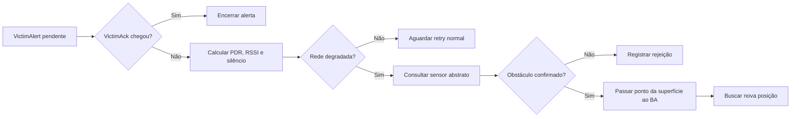
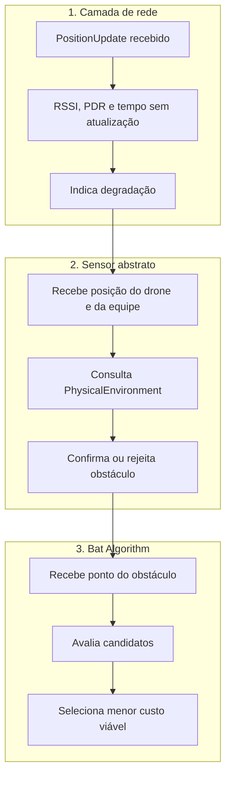
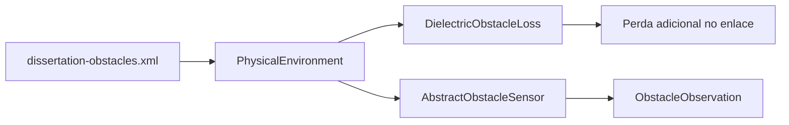
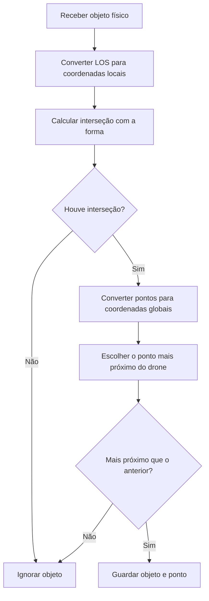
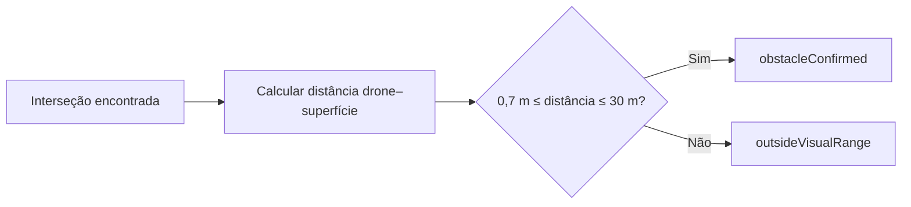
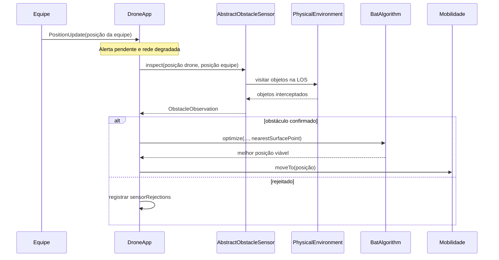
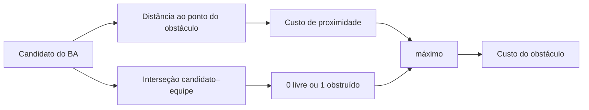
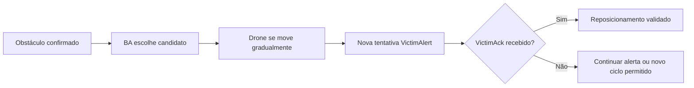

# Guia visual: identificação e uso da posição do obstáculo

## Visão geral

O ECHOSAR-Net não implementa uma câmera real. Ele utiliza um sensor abstrato
que consulta a geometria conhecida pelo simulador. A rede detecta apenas sinais
de degradação; quem confirma a existência do obstáculo é o sensor.



## Três responsabilidades diferentes



| Componente | O que sabe | O que não deve concluir sozinho |
|---|---|---|
| Rede | ACK ausente, RSSI, PDR e última recepção | que a perda foi causada por obstáculo |
| Sensor abstrato | interseção geométrica e alcance | que o enlace será recuperado |
| BA | custos estimados de candidatos | que uma aptidão baixa garante AppACK |
| INET | propagação e recepção efetivas | qual decisão operacional deve ser tomada |

## De onde vem o obstáculo?

Os objetos são definidos em `simulations/dissertation-obstacles.xml` e
carregados pelo `PhysicalEnvironment` do INET.



O mesmo objeto geométrico possui dois usos independentes:

1. `DielectricObstacleLoss` altera fisicamente a potência recebida;
2. `AbstractObstacleSensor` informa se a linha de visada cruza o objeto.

Adicionar apenas um desenho ao Qtenv não causaria perda de rádio. O objeto
precisa pertencer ao `PhysicalEnvironment` conectado ao meio de rádio.

## Como a linha de visada é construída?

O drone utiliza sua posição atual e a última posição da equipe recebida por
`PositionUpdate`.

```text
 z
 ↑
 |                 drone (xd, yd, zd)
 |                       ●
 |                      /|
 |                     / |  linha de visada 3D
 |          obstáculo /  |
 |             ┌─────────┐
 |             │    ×    │ ← primeiro ponto de interseção
 |             │         │
 |             └─────────┘
 |                   /
 |                  ● equipe (xe, ye, ze)
 +------------------------------------------------→ x,y
```

O segmento consultado é:

$$
L(s)=\mathbf{p}_{drone}+s
(\mathbf{p}_{team}-\mathbf{p}_{drone}),
\qquad 0\leq s\leq1
$$

O sensor procura os objetos que interceptam esse segmento.

## Como a interseção é calculada?



A conversão para coordenadas locais é necessária porque cada obstáculo pode
ter posição e orientação próprias. Depois do cálculo, o ponto volta ao sistema
global usado pelos drones.

## Centro versus superfície

```text
                    centro geométrico
                           ●
             ┌─────────────┐
 drone ● ───────×──────────│────── ● equipe
             ↑             │
             primeiro ponto   │
             da superfície    │
             └─────────────┘
```

O sensor retorna os dois valores:

- `center`: centro geométrico do objeto;
- `nearestSurfacePoint`: primeira superfície encontrada a partir do drone.

O BA recebe `nearestSurfacePoint`, porque esse ponto representa onde a linha de
visada começa a ser bloqueada.

## Validação do alcance

Uma interseção geométrica não significa automaticamente que o sensor confirmou
o obstáculo.



Os resultados possíveis são:

| `reason` | Significado |
|---|---|
| `invalidTargetDirection` | drone e equipe ocupam a mesma posição |
| `clearLineOfSight` | nenhum objeto intercepta o segmento |
| `outsideVisualRange` | existe interseção, mas fora do alcance configurado |
| `obstacleConfirmed` | existe interseção dentro do alcance |

## Dados entregues ao DroneApp

```text
ObstacleObservation
├── confirmed             confirmação final do sensor
├── obstacleId            identificador numérico do objeto
├── obstacleName          nome definido no XML
├── center                centro geométrico
├── nearestSurfacePoint   primeiro ponto da superfície
├── distance              distância drone–superfície
├── timestamp             instante da consulta
└── reason                motivo da confirmação ou rejeição
```

O objeto não envia uma mensagem pela rede. A estrutura é retornada por uma
chamada local e síncrona:

```cpp
auto observation = sensor->inspect(dronePosition, teamPosition);
```

## Como a posição chega ao BA?



O ponto é capturado pela função de aptidão:

```cpp
computeFitness(candidate, current, team, observation.nearestSurfacePoint)
```

## Uso na função de aptidão

O primeiro uso penaliza candidatos próximos da superfície detectada:

$$
C_{prox}(\mathbf{p})=
\exp\left(
-\frac{\lVert\mathbf{p}-\mathbf{p}_{obs}\rVert}{\sigma_{obs}}
\right)
$$

O segundo uso verifica se a nova linha candidato–equipe continua obstruída:

$$
C_{obs}(\mathbf{p})=
\max\left(C_{prox}(\mathbf{p}),I_{LOS}(\mathbf{p})\right)
$$



Se a linha continuar obstruída, o custo de obstáculo será 1, mesmo que o
candidato esteja distante do primeiro ponto detectado.

## O que confirma o sucesso?



Nem a confirmação sensorial nem uma aptidão baixa representam sucesso. O
reposicionamento somente é considerado bem-sucedido quando uma equipe envia um
`VictimAck` e ele chega ao drone originador.

## Arquivos relacionados

| Arquivo | Responsabilidade |
|---|---|
| `simulations/dissertation-obstacles.xml` | geometria e material dos obstáculos |
| `simulations/omnetpp.ini` | ativa ambiente, perda e alcance sensorial |
| `src/sensing/AbstractObstacleSensor.*` | interseção, alcance e observação |
| `src/app/DroneApp.*` | decide quando consultar e acionar o BA |
| `src/optimization/BatAlgorithm.*` | procura a posição candidata |
| `src/mobility/BaGaussMarkovMobility.*` | executa o deslocamento gradual |
| `docs/bat_algorithm_and_fitness.md` | equações completas da otimização |

## Limitações do modelo

- a geometria real é conhecida pelo simulador;
- não existe processamento de imagem;
- o sensor é orientado abstratamente para a equipe;
- FOV, iluminação e textura são premissas, não modelos implementados;
- não há ruído na posição estimada do obstáculo;
- a equipe pode ter se movido desde seu último `PositionUpdate`;
- detectar o obstáculo não prova que ele foi a única causa da perda.

Essas limitações devem acompanhar a interpretação dos resultados da
dissertação.
